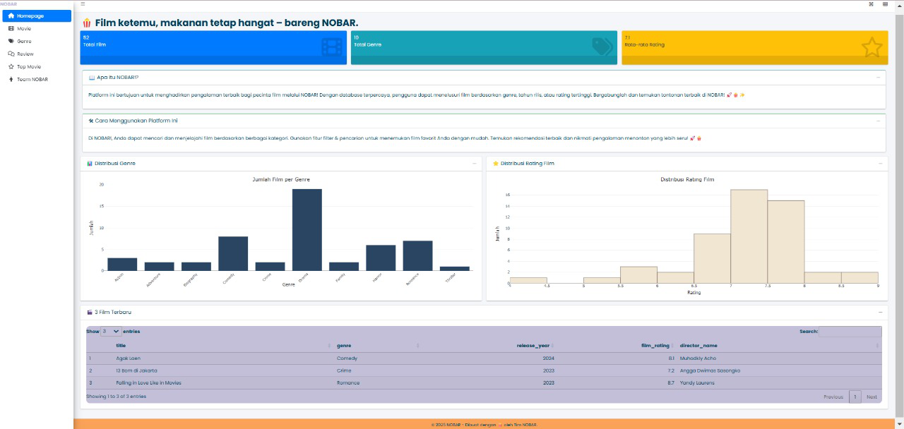
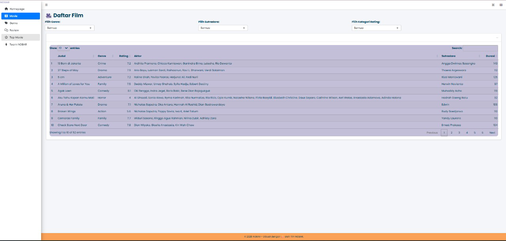
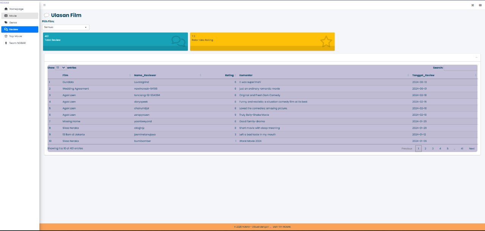
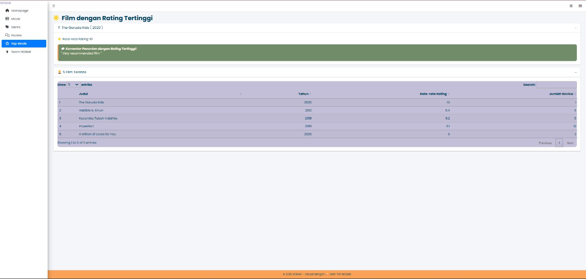
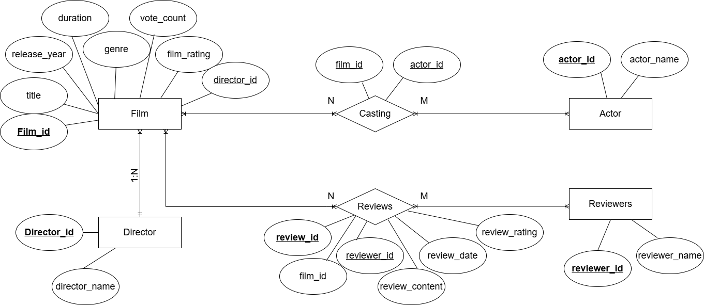

<h1 align="center">🎬 <b>Selamat Datang di NOBAR!</b> 🚀🍿</h1>

<h2 align="center"><i>"Big Reviews, Big Decisions"</i></h2>

## 📑Menu

-   [Informasi](#pushpin-information)
-   [Tentang NOBAR](#clipboard-about)
-   [Screenshot Tampilan](#camera-screenshot)
-   [Demo & GitHub Repository](#card_file_box-demo)
-   [Syarat dan Ketentuan](#exclamation-requirements)
-   [Skema Basis Data](#floppy_disk-database-scheme)
-   [ERD](#rotating_light-erd)
-   [Deskripsi Data](#heavy_check_mark-data-description)
-   [Struktur Folder](#open_file_folder-folder-structure)
-   [Tim NOBAR](#heavy_heart_exclamation-our-team)

## 📌 Informasi {#pushpin-information}

🎬 NOBAR - Platform Eksplorasi & Ulasan Film

🍿FILM KETEMU, MAKANAN TETAP HANGAT - BARENG NOBAR 🎥

**Berikut informasi tentang NOBAR :**

## 🚀Apa itu NOBAR?

**NOBAR!** adalah Platform ini bertujuan untuk menghadirkan pengalaman terbaik bagi pecinta film melalui NOBAR! Dengan database terpercaya, pengguna dapat menelusuri film berdasarkan genre, tahun rilis, atau rating tertinggi. Bergabunglah dan temukan tontonan terbaik di NOBAR!🚀🍿✨

## 🔎Cara Menggunakan Platform ini?

1.  Gunakan **menu navigasi** di sidebar untuk berpindah antar fitur.
2.  Jelajahi daftar film dan gunakan **filter pencarian** untuk menemukan film favorit.
3.  Baca ulasan film dari pengguna lain sebelum menonton.
4.  Lihat **film dengan rating tertinggi** untuk rekomendasi terbaik.
5.  Kunjungi halaman **Team NOBAR** untuk mengetahui lebih lanjut tentang tim pengembang.

## 📋: Tentang NOBAR {#clipboard-about}

Tugas akhir mata kuliah Manajemen Data Statistik ini mengambil topik Database Platform NOBAR. Analisis proyek ini bertujuan untuk merancang dan mengoptimalkan sistem manajemen database film, termasuk entitas seperti film, sutradara, aktor, ulasan, dan reviewer. Struktur database dirancang dengan model relasional yang memanfaatkan entitas dan referensial integrity constraints untuk memastikan validitas data. Dataset yang digunakan dalam proyek ini bersumber dari Dataset Mata Kuliah Manajemen Data Statistika. Hasil yang diharapkan adalah sebuah aplikasi web yang memungkinkan pengguna untuk menelusuri film berdasarkan genre, melihat ulasan pengguna, serta mengevaluasi film dengan rating tertinggi. Pengguna dapat mencari data berdasarkan kategori tertentu, misalnya pencarian film berdasarkan genre, tahun rilis, atau sutradara.

## 📷: Screenshot Tampilan NOBAR {#camera-screenshot}

1.  **Tampilan Menu Utama atau Homepage**

    -   Menampilkan jumlah total film, jumlah genre, dan rata-rata rating film.

    -   Ringkasan tentang platform dan cara penggunaannya.

    -   Statistik distribusi film berdasarkan genre dan rating dalam bentuk grafik.

    -   Daftar 3 film terbaru yang mencakup informasi judul, genre, tahun rilis, rating, dan sutradara

    

2.  **Daftar Film atau Movie**

    -   Pengguna dapat menelusuri film yang tersedia berdasarkan berbagai filter:
        -   Genre
        -   Sutradara
        -   Kategori Rating
    -   Setiap film menampilkan informasi lengkap seperti judul, genre, rating, aktor, sutradara, dan durasi.
    -   Fitur pencarian untuk menemukan film dengan cepat.

    

3.  **Tampilan Cari Film berdasarkan Genre**

    -   Pengguna dapat mencari film berdasarkan:
        -   Genre
        -   Tahun Rilis
    -   Statistik visual mengenai distribusi film berdasarkan genre dan tahun rilis dalam bentuk grafik.

    

4.  **Tampilan Review atau Ulasan Film**

    -   Menampilkan daftar ulasan film dari pengguna dengan fitur filter berdasarkan film tertentu.
    -   Informasi ulasan mencakup:
        -   Nama Reviewer
        -   Rating
        -   Komentar
        -   Tanggal Review
    -   Total jumlah ulasan film ditampilkan secara real-time.

    

5.  **Tampilan Film dengan Rating Tertinggi atau Top Movie**

    -   Menampilkan film dengan rating tertinggi berdasarkan ulasan pengguna.
    -   Daftar 5 film terbaik berdasarkan rating rata-rata, tahun rilis, dan jumlah ulasan.
    -   Komentar terbaik dari pengguna terkait film dengan rating tertinggi.



## 🗃️:  **Demo & GitHub Repository** {#card_file_box-demo}

💻 **R-Shiny Demo:** [NOBAR Shiny](http://127.0.0.1:5923/)\
📂 **GitHub Repository:** [NOBAR GitHub](https://github.com/mhmmadyusran/mds_kel5-nobar-team)

## ❗: Syarat dan Ketentuan {#exclamation-requirements}

-   Scrapping Data menggunakan paket R rvest dan paket lain misalnya tidyverse, rio, kableExtra dan stingr

-   RDBMS adalah PostgreSQL dan ElephantSQL

-   Dasbor adalah shinny, shinnythemes, bs4Dash, DT, dan dplyr dari paket R

## 💾: Skema Basis Data {#floppy_disk-database-scheme}

Deskripsi struktur untuk *primary key* yaitu **film (film_id)**, **director(director_id)**, **actor(actor_id)**, dan **reviewers(reviewer_id)**, juga untuk foreign key ada **casting (film_id dan actor_id)** dan **reviews(reviewer_id)** dalam membangun hubungan antar tabel atau entitas.


## 🔗: ERD {#rotating_light-erd}

ERD (Entity Relationship Diagram) menjelaskan hubungan antara entitas dan atribut. Di dalam project ini, untuk semua atribut director, film, casting, actor, reviews dan reviewers yang dihubungkan ke entitas film.



### **🌐 Relasi Antar Entitas**

| **Hubungan** | **Penjelasan** |
|------------------------------------|------------------------------------|
| **Film → Sutradara (1:N)** | Satu film hanya memiliki **satu sutradara**, tetapi satu sutradara bisa menyutradarai **banyak film**. |
| **Film → Casting → Aktor (M:N)** | Satu film bisa memiliki **banyak aktor**, dan satu aktor bisa bermain di **banyak film**. Oleh karena itu, relasi **many-to-many** ini dihubungkan melalui **tabel Casting**. |
| **Film → Review (1:N)** | Satu film bisa memiliki **banyak ulasan**, tetapi satu ulasan hanya terkait dengan **satu film**. |
| **Reviewer → Review (1:N)** | Satu **reviewer** dapat memberikan **banyak ulasan** untuk berbagai film, tetapi satu ulasan hanya berasal dari **satu reviewer**. |

## ✔️📄Deskripsi Data {#heavy_check_mark-data-description}

Terdiri dari Table, sintaks SQL dan DDL.

### 🧮Membuat Database atau Basis Data

Basis Data NOBAR menyimpan informasi yang mewakili atribut data yang saling berhubungan untuk analisis.

``` sql
CREATE DATABASE IF NOT EXISTS film_dashboard;

USE film_dashboard;
```

### 🎬Membuat Tabel Directors

Tabel Directors menyediakan informasi tentang entitas Sutradara. Pengguna dapat mengetahui dari ID sutradara, nama sutradara.

| Attribute        | Type                   | Description       |
|------------------|------------------------|-------------------|
| director_id (PK) | Character Varying(5)   | ID unik sutradara |
| director_name    | Character Varying(255) | Nama sutradara    |

with the SQL script :

``` sql
CREATE TABLE IF NOT EXISTS directors (
  director_id VARCHAR(5) PRIMARY KEY,
  director_name VARCHAR(255)
);
```

### 📽️Membuat Tabel Film

Tabel Film menyediakan informasi tentang entitas Film. Pengguna dapat mengetahui dari ID Film, judul film (title), tahun rilis film, durasi film dalam menit, genre film, jumlah suara penonton, rating rata-rata film, dan ID Sutradara (dimana atribut ini adalah foreign key ke tabel directors).

| Attribute | Type | Description |
|----|----|----|
| film_id (PK) | Character Varying(5) | ID unik setiap film |
| title | Character Varying(255) | Judul film |
| release_year | Integer | Tahun rilis film |
| duration | Integer | Durasi film dalam menit |
| genre | Character Varying(100) | Genre film |
| vote_count | Integer | Jumlah suara penonton |
| film_rating | Floating | Rating rata-rata film |
| director_id (FK) | Character Varying(5) | ID sutradara (foreign key ke tabel directors) |

with the SQL script :

``` sql
CREATE TABLE IF NOT EXISTS films (
  film_id VARCHAR(5) PRIMARY KEY,
  title VARCHAR(255),
  release_year INT,
  duration INT,
  genre VARCHAR(100),
  vote_count INT,
  film_rating FLOAT,
  director_id VARCHAR(5),
  FOREIGN KEY (director_id) REFERENCES directors(director_id)
);
```

### 🎭Membuat Tabel Casting

Tabel Casting menyediakan informasi tentang entitas Casting. Pengguna dapat mengetahui dari ID Film dan ID Aktor.

| Attribute              | Type                 | Description |
|------------------------|----------------------|-------------|
| film_id (PK) dan (FK)  | Character Varying(5) | ID film     |
| actor_id (PK) dan (FK) | Character Varying(5) | ID aktor    |

with the SQL script :

``` sql
CREATE TABLE IF NOT EXISTS casting (
  film_id VARCHAR(5),
  actor_id VARCHAR(5),
  FOREIGN KEY (film_id) REFERENCES films(film_id),
  FOREIGN KEY (actor_id) REFERENCES actors(actor_id),
  PRIMARY KEY (film_id, actor_id)
);
```

### 👥 Membuat Tabel Actors

Tabel Actors menyediakan informasi tentang entitas Aktor. Pengguna dapat mengetahui dari ID Aktor dan nama Aktor.

| Attribute     | Type                   | Description   |
|---------------|------------------------|---------------|
| actor_id (PK) | Character Varying(5)   | ID unik aktor |
| actor_name    | Character Varying(255) | Nama aktor    |

with the SQL script :

``` sql
CREATE TABLE IF NOT EXISTS actors (
  actor_id VARCHAR(5) PRIMARY KEY,
  actor_name VARCHAR(255)
);
```

### 🗣️Membuat Tabel Reviews

Tabel Reviews menyediakan informasi tentang entitas Ulasan. Pengguna dapat mengetahui dari ID ulasan, ID film yang diulas, ID pengulas (orang yang memberikan ulasan), tanggal ulasan dibuat, isi ulasan, dan rating yang diberikan.

| Attribute        | Type                   | Description           |
|------------------|------------------------|-----------------------|
| review_id (PK)   | Character Varying(7)   | ID unik ulasan        |
| film_id (FK)     | Character Varying(255) | ID film yang diulas   |
| reviewer_id (FK) | Character Varying(5)   | ID pengulas           |
| review_date      | Date                   | Tanggal ulasan dibuat |
| review_content   | Text                   | Isi ulasan            |
| review_rating    | Integer                | Rating yang diberikan |

: with the SQL script :

``` sql
CREATE TABLE IF NOT EXISTS reviews (
  review_id VARCHAR(7) PRIMARY KEY,
  film_id VARCHAR(5),
  reviewer_id VARCHAR(5),
  review_date DATE,
  review_content TEXT,
  review_rating INT,
  FOREIGN KEY (film_id) REFERENCES films(film_id),
  FOREIGN KEY (reviewer_id) REFERENCES reviewers(reviewer_id)
);
```

### 📝Membuat Tabel Reviewers

Tabel Reviews menyediakan informasi tentang entitas Pemberi Ulasan (pengulas). Pengguna dapat mengetahui dari ID pemberi ulasan, ID film yang diulas, Nama Pengulas (Pemberi Ulasan).

| Attribute        | Type                   | Description      |
|------------------|------------------------|------------------|
| reviewer_id (PK) | Character Varying(5)   | ID unik pengulas |
| reviewer_name    | Character Varying(255) | Nama pengulas    |

with the SQL script :

``` sql
CREATE TABLE IF NOT EXISTS reviewers (
  reviewer_id VARCHAR(5) PRIMARY KEY,
  reviewer_name VARCHAR(255)
);
```

## 📂Struktur Folder {#open_file_folder-folder-structure}

```         
.
├── app           # Kode untuk aplikasi Shiny
│   ├── server.R  # Logika server untuk aplikasi Shiny
│   └── ui.R      # Antarmuka pengguna untuk aplikasi Shiny
├── con           # Konfigurasi dan preprocessing data
│   ├── data_wragling.qmd          # Pengolahan data sebelum analisis
│   ├── input_data_to_mysql.qmd    # Skrip untuk memasukkan data ke dalam MySQL
├── data          # Data yang digunakan dalam proyek
│   ├── clean     # Data yang telah dibersihkan
│   ├── raw       # Data mentah sebelum diproses
├── doc           # Dokumentasi proyek
│   ├── .Rhistory                         
│   ├── ERD.html                           # Dokumentasi mengenai ERD dalam format HTML
│   ├── ERD.png                            # Diagram ERD dalam format gambar
│   ├── ERD.qmd                            # Dokumentasi mengenai ERD
│   ├── Referential integrity constraints.png  # Diagram referensial integritas
├── images        # Gambar yang digunakan dalam proyek
│   ├── abil.png
│   ├── aini.png
│   ├── dilla.png
│   ├── genre.png
│   ├── header nobar team.png
│   ├── homepage.png
│   ├── movie.png
│   ├── review.png
│   ├── top movie.png
│   ├── ucang.png
│   ├── wina.png
├── .Rhistory       # Riwayat eksekusi kode R
├── Film Dashboard.Rproj  # File proyek RStudio
└── README.md       # Dokumentasi utama proyek
```

## 🛠 Teknologi yang Digunakan

-   R ShinyFramework utama untuk membangun aplikasi dashboard interaktif.

-   ShinyDashboard & bs4Dash – Untuk tampilan UI modern dan responsif.

-   MySQL (RMySQL & DBI) – Untuk manajemen database film dan ulasan.

-   tidyverse (dplyr, ggplot2) – Untuk manipulasi dan analisis data.

-   Plotly – Untuk grafik interaktif.

-   TablePlus – Untuk tampilan tabel data yang interaktif.

-   Markdown, Google Plus dan Canva - Untuk deskripsi proyek, fitur, dan panduan teknis.

## 🤝🧑‍🤝‍🧑Our Team {#heavy_heart_exclamation-our-team}

-   **Database Manager : [Muhammad Yusran](https://github.com/mhmmadyusran) (M0501241064) 🧑‍💻⚙️ - Mengelola migrasi database ke server, memastikan keamanan dan kinerja data.**

    

-   **Front End Developer : [Nabillah Rahmatiah Tangke](https://github.com/nabillahtangke) (M0501241070) 🎨 - Membangun tampilan dashboard agar responsif, menarik dan user-friendly.**

    

-   **Backend Developer: [Siti Nuradilla](https://github.com/nradillas) (M0501241010) 🖥️ - Memproses pemanggilan query dan logika bisnis untuk mendukung tampilan dashboard.**![]

    

-   **Designer Database : [Nur'aini](https://github.com/nuraiiini) (M0501241058) 📊 - Mendesain skema Entity Relationship Diagram (ERD) untuk mengoptimalkan struktur database.**

    

-   **Technical Writer: [Aisya Wina Wahda](https://github.com/aisyawina) (M0501241053) ✍️ - Mendokumentasikan deskripsi proyek, fitur, dan panduan teknis.**

    

## 📜 Lisensi

*Tugas ini dibuat oleh Mahasiswa Pascasarjana Statistika dan Sains Data IPB University 2024 sebagai karya dengan akses terbuka untuk memenuhi salah satu tugas mata kuliah Manajemen Data Statistika (STA 1562).* 📊🎓🚀